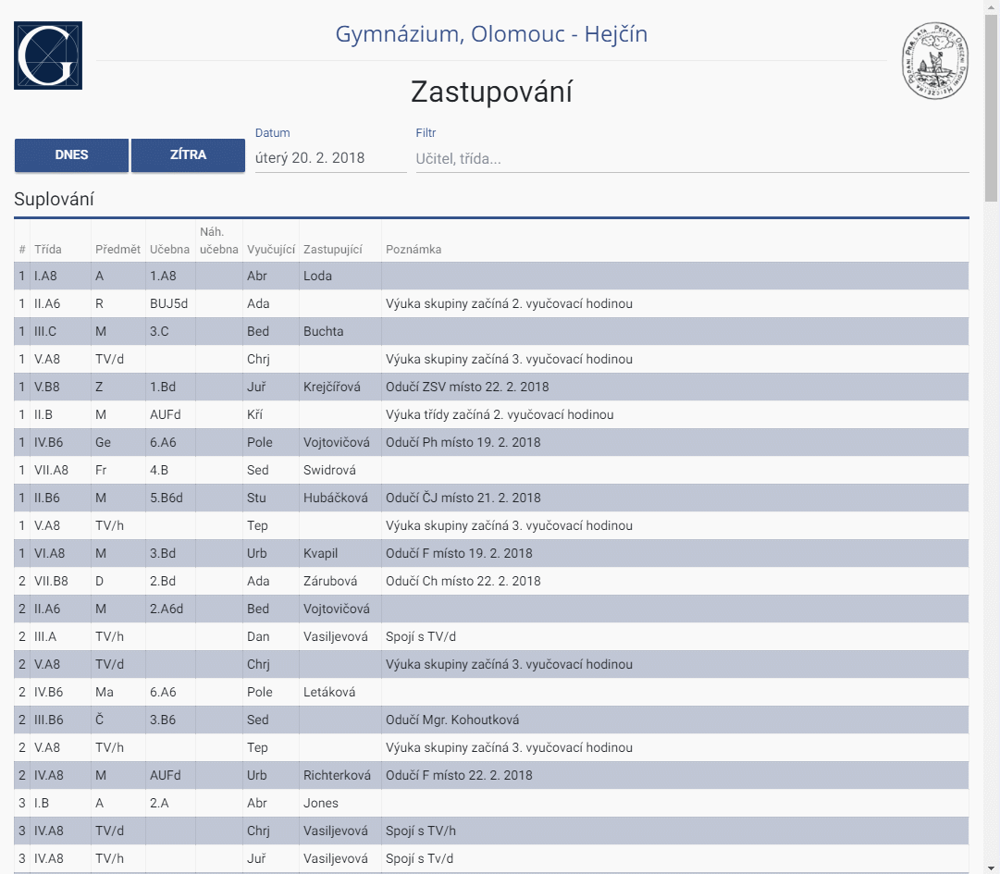

# better-zastupovani 📆👨‍🏫

### [Official live version](https://jouzalol.github.com/better-zastupovani)

## Features
- **Filtering**

- **Multi filtering**

## Feedback 
Any feedback is highly appreciated! Please open an issue/PR or drop me a message on facebook (Josef Vacek)

## Goal
Provide a friendly and useful interface for anyone wanting to learn about the current changes in schedule, regardless of viewing environment. (mobile and desktop)

## Compatibility
Supports any modern browser - Chrome, Firefox, Safari and even IE11

Web APIs:
- Using:
	- fetch
	- ES6 Array.prototype.includes
	- Promises
- Planned
	- TextDecoder (when Edge supports it)
	- Notifications
	- WebWorkers

## Description

Better Zastupovani is an open-source attempt to enhance the current Zastupovani at [gytool](http://suplovani.gytool.cz)

The current software in use suffers from many flaws (and is horribly outdated), which Better Zastupovani tries to correct.

The data used in Better Zastupovani is pulled directly from the old system.